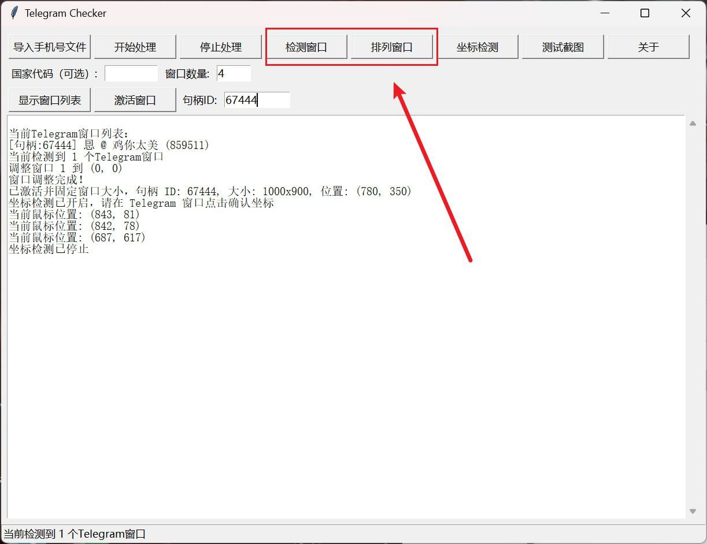

# TG
SEO Keyword：telegram，TG，telegram用户检测，telegram注册检测，自动化应用,
# Telegram Checker v1.0

**Telegram Checker** 是一款专为 Telegram 用户设计的自动化工具，旨在高效批量检测手机号是否注册 Telegram 账号，并获取用户的最后上线时间。通过结合界面自动化技术，该软件能够简化繁琐的手动操作，为个人用户、营销人员或数据分析者提供便捷的解决方案。

## 核心功能

1. **批量手机号检测**  
   - 支持从文本文件导入手机号列表，自动逐一验证是否为 Telegram 注册用户。  
   - 智能区分“存在”和“不存在”的账号，结果清晰记录。

2. **上线时间提取**  
   - 对于存在的账号，自动识别并提取最后上线时间（如“近期曾上线”），无需手动查看。

3. **多窗口管理**  
   - 支持打开和排列多个 Telegram 窗口，优化屏幕空间利用，提升处理效率。

4. **坐标定位与自动化**  
   - 用户可自定义操作坐标，软件通过模拟点击完成添加联系人流程，操作简单稳定。

5. **日志与结果导出**  
   - 实时显示处理进度，检测结果自动保存至文件，便于后续分析。

## 产品特点

- **高效稳定**：单个窗口每 5 秒处理一个号码，单个窗口每天可验证超过 17,000 个手机号。  
- **用户友好**：图形化界面，操作直观，支持密码验证确保安全性。  
- **灵活性强**：支持自定义国家代码，适应不同地区需求。  
- **可扩展性**：基于模块化设计，未来可轻松升级。
- **账户安全**：无封号风险，完全脱离抓包，接口使用。安全稳定不封号。

## 适用场景

- **个人用户**：快速检查联系人是否使用 Telegram。  
- **营销人员**：批量验证目标客户手机号，筛选活跃用户。  
- **数据分析**：收集 Telegram 用户状态数据，辅助市场调研。

## 未来展望

Telegram Checker v1.0 是我们的初版产品，未来将推出更快的检测速度等功能，敬请期待！

## 获取与支持

- **版本**：v1.0（发布日期：2025年3月18日）  
- **开发者**：@yingying_guai,https://t.me/yingying_guai
- **联系方式**：欢迎通过 Telegram 反馈意见，助力我们完善产品。

